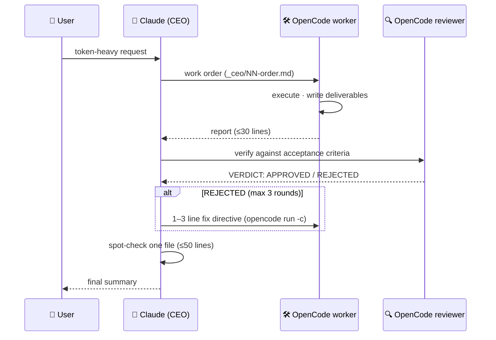

<div align="center">

# 👔 ceo

**Token-limited Claude plans. An unlimited local model executes. Nobody approves their own work.**

A [Claude Code](https://claude.com/claude-code) skill that turns a token-budgeted Claude into a CEO —
writing work orders and reading verdicts — while [OpenCode](https://opencode.ai) (running your unlimited
local/self-hosted model) does all the reading, writing, and reviewing.

[](LICENSE)
[](https://claude.com/claude-code)
[](https://opencode.ai)
[](https://github.com/Judy-0509/ceo-skill/pulls)

</div>

---

## 🧭 Why

Some environments give you a strong-but-metered Claude and an unmetered local model side by side.
The naive split — "Claude does the hard parts" — burns the budget fast, because *reading the source
material* is the expensive part: every document Claude opens stays in context and is re-billed on
every subsequent turn.

**ceo** fixes the economics by fixing the org chart:

| | Claude (CEO) | OpenCode (staff) |
|---|---|---|
| Budget | 💸 metered | ♾️ unlimited |
| Does | analysis · work orders · final verdict | execution **and** review |
| Reads | tiny `_ceo/*.md` files only | everything else |
| Cost scales with | number of decisions | — (free) |

## ⚙️ How it works



Three design decisions carry the whole thing:

1. **The role boundary is fixed at design time, not judged at runtime.**
   Claude follows a closed whitelist of **7 allowed actions**; everything not on the list is
   delegated by default (*default-deny*). This matters because the orchestrating model may be a
   small / low-effort one — it should pattern-match, not exercise discretion.
2. **Author / reviewer separation.** The reviewer runs in a fresh OpenCode session, so the worker
   never approves its own output.
3. **Everything flows through files**, never through Claude's chat context — work orders, reports,
   verdicts, digests. Claude never pastes source content into its own context.

## 📦 Install

```bash
git clone https://github.com/Judy-0509/ceo-skill ~/.claude/skills/ceo
```

> The target folder **must be named `ceo`** — folder name = skill name = the `/ceo` command.

**Requirements**

- Claude Code with skills support
- OpenCode CLI on `PATH` — verify `opencode run "hello"` works non-interactively and your version
  supports `-c` (continue last session)
- OpenCode configured with your unlimited-budget model as default
  (or add `-m provider/model` to the commands in `SKILL.md`)

## ⚡ Use

The skill **auto-triggers** on token-heavy requests — document summarization, wiki/DB building,
multi-file code work — no need to ask for delegation. Invoke explicitly with `/ceo`.

Smoke-test cases: [`test-prompts.md`](test-prompts.md)

## 🧩 Work-order recipes

Claude never designs delegation prompts from scratch — it copies a pre-verified recipe from
[`references/recipes.md`](references/recipes.md) and fills in the blanks:

| Recipe | For | Key trick |
|---|---|---|
| **R1** Document digest | PDF / DOCX / PPTX, any count | Builds a per-doc digest (claims · figures · page refs), not a summary — the substrate for later Q&A |
| **R2** Excel aggregation | Spreadsheet reading & rollups | Acceptance = re-computed totals match, row counts preserved, error cells reported |
| **R3** Follow-up Q&A loop | "Now I need one more thing…" | Questions go to `_ceo/NN-qa.md`, answered via `opencode run -c` — the worker's session context is reused, re-ingestion cost **zero** |
| **R4** Wiki / DB build | Structured knowledge bases | Two-phase: schema proposal (30 lines) → confirm → full build. One cheap check beats three expensive rejections |
| **R5** Code work | Implementation & tests | Reviewer *runs* the tests — passing claims are not evidence |
| **R6** Generic fallback | Everything else | Any request → goal + input paths + deliverable + ≥3 checkable acceptance criteria |

## 💰 The token math

Reading 10 reports (~200k tokens) directly puts them **in context permanently** — re-billed as
input on every later turn. Five follow-up questions ≈ 1M+ tokens billed.

With ceo: work order (~300) + digest (~1,500) + 5 Q&A round-trips (~2,500) ≈ **under 5k tokens**,
independent of document size. Cost scales with *questions asked*, not *pages read*.

The only case where direct reading wins — a 1–2 page document, one question — is already carved
out by the skill's mechanical exception (answerable without opening any file, chat-only output,
≤30 lines).

## 🎛 Customize

- The skill body is written in Korean (our team's language). Model-facing instructions work as-is;
  translate freely if your team prefers English.
- To enforce a team style guide on deliverables, put its file path in the work-order template's
  rules section — the OpenCode worker will read and follow it.
- Different CLI? Any non-interactive runner with a session-continue flag can stand in for
  OpenCode — adjust the two commands in `SKILL.md`.

---

<details>
<summary><b>🇰🇷 한국어 요약</b></summary>

<br>

토큰 예산이 제한된 Claude가 **CEO**(요구 분석 · 작업지시서 · 최종 판정)만 맡고, 토큰 무제한
OpenCode가 **실행과 검토를 모두** 수행하는 오케스트레이션 스킬입니다.

- 역할 경계는 실행 시점 판단이 아니라 **설계 시점에 고정** — 허용 행동 7종 whitelist, 기본값 = 위임
- 작성자와 검토자 세션을 분리해 **셀프 승인 차단**, 반려 시 최대 3라운드 재작업 루프
- 여러 문서는 "R1 반입 → digest → R3 질의 루프"로 처리 — 비용이 문서 크기가 아니라
  **질문 수에 비례**
- 설치: 위 `git clone` 명령으로 `~/.claude/skills/ceo`에 받으면 `/ceo` 명령어로 바로 사용

</details>

## 📄 License

[MIT](LICENSE) © 2026 Judy-0509
